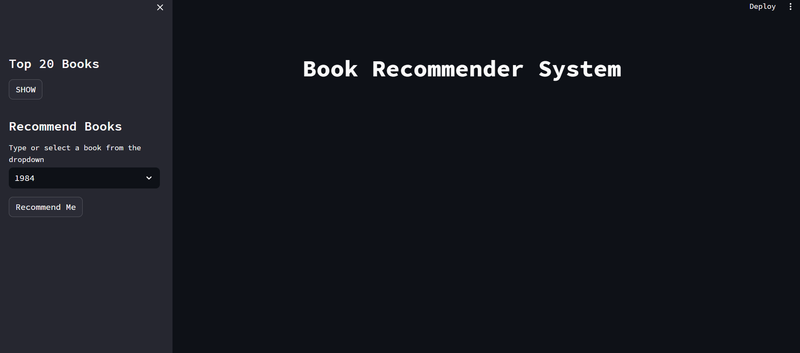
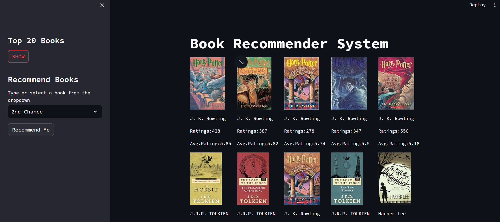
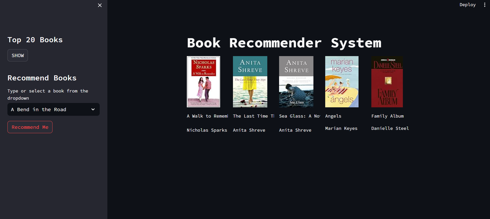

# Book Recommendation System

## Overview
This project implements a simple book recommendation system using Streamlit, a Python library for creating interactive web applications. The recommendation system is based on collaborative filtering and popularity based recommendation system provides personalized book suggestions to users.

The Project has two main objectives:

### Objective 1
To display Top 20 most suggested books or popular books which are filtered through from the data provided using Popularity Based Recommendation System.

### Objective 2
To recommend 5 books to user enter book.This is done by using collaborative based Recommendation System which uses cosine similiarity search.
And in this project the major concern was to focus on user ratings and make recommendation based on that.

Streamlit framework is being used for its deployment.

## Dependencies
  -Python 3.x

  -Streamlit

  -Pandas

  -Scikit-learn (for collaborative filtering)

  -pickle 
  
## Installation

1. Clone the repository:

    ```bash
    git clone https://github.com/abhiram4580/Book_Recommendation_System.git
    

2.- ***For Web Framework Requirements:*** ```pip install -r requirements.txt```


## Data
Download from: https://www.kaggle.com/datasets/arashnic/book-recommendation-dataset

There is 3 csv files available for the project.
    
-Books.csv

-Ratings.csv

 -Users.csv
After downloading 3 of them, you can start cleaning and building a model.
In this project, Cosine Similarity was used for building collaborative filtering recommender system.

## Usage
1. Run the Streamlit app by:
    ```bash
    streamlit run app.py

2.Open your web browser and navigate to http://localhost:8501 to access the book recommendation system.

3.Input your preferences or choose a user profile to get personalized book recommendations.

## Screenshot
- 
- 
-
    


   
  


